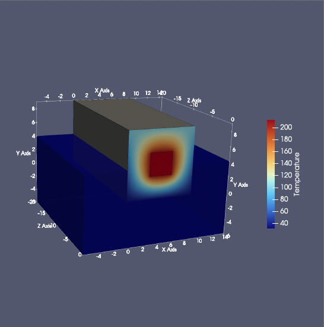

# Scientific Visualization and Virtual Reality

Assignments for the course Scientific Visualization and Virtual Reality at the University of Amsterdam.

## Car Characteristics Visualization (1970-1982)

### Overview

This project visualizes the evolution of car characteristics from 1970 to 1982, focusing on the relationships between MPG (Miles Per Gallon), horsepower, weight, engine configuration, and country of origin. The visualization uses multiple visual channels to encode different variables simultaneously.

### Data

The visualization uses the `cars.csv` dataset containing the following columns:

- model: Car model name
- MPG: Miles per gallon fuel efficiency
- cylinders: Number of engine cylinders (3-8)
- horsepower: Engine power (45-230 HP)
- weight: Vehicle weight (1600-5200 lbs)
- year: Manufacturing year (1970-1982)
- origin: Country/region of manufacture (US, Japan, Europe)

### Features

- **Interactive Visualization**:
  - Hover over data points to see detailed car information
  - Hover over trendlines to see origin-specific statistics
  - Dynamic highlighting of origin groups

- **Visual Encodings**:
  - X-axis: Year
  - Y-axis: MPG
  - Marker shape: Number of cylinders (polygon sides match cylinder count)
  - Marker size: Horsepower (larger = more powerful)
  - Marker opacity: Weight (more opaque = heavier)
  - Marker color: Country of origin (US=blue, Japan=orange, Europe=green)
  - Dashed lines: MPG trends per origin

### Requirements

- Python 3.x
- Required packages:
 ```
  pandas
  matplotlib
  seaborn
  numpy
  mplcursors
  ```

### Installation

1. Clone the repository
2. Install required packages:

   ```bash
   pip install pandas matplotlib seaborn numpy mplcursors
   ```

### Usage

Run the visualization script:

```bash
python visualisation.py
```

The script will generate a high-resolution plot (`cars-highres.png`) and display the interactive visualization.


### Output

The visualization will be saved as `cars-highres.png` with a resolution of 500 DPI, suitable for publication or detailed viewing.


## Assignment 2: Simulating and Visualising Temperature Distribution in a Material

### Overview
This project simulates the temperature distribution in a material using a grid-based approach. The simulation models heat diffusion over time and outputs the results as VTK files for visualization in Paraview.

### Data
The simulation uses a grid of size 90x90, initialized with specific temperature conditions:
- The entire grid is initially set to 70°F.
- A central region is set to 212°F to simulate a heat source.
- The left boundary is set to 32°F, and the right boundary to 100°F.
- The top and bottom boundaries have a linear temperature gradient from 32°F to 100°F.

### Features
- **Heat Diffusion Simulation**:
  - Iterative calculation of temperature distribution over time.
  - Boundary conditions and initial heat source setup.
  
- **VTK Output**:
  - Saves each timestep's temperature distribution as a VTK file for visualization.

### Requirements
- Python 3.x
- Required packages:
  ```
  vtk
  numpy
  ```

### Installation
1. Clone the repository
2. Install required packages:
   ```bash
   pip install vtk numpy
   ```

### Usage
Run the heat simulation script:
```bash
python /Users/sandor/Desktop/heat-simulation-vtk.py
```

The script will generate VTK files in the specified directory, which can be used for visualization in VTK-compatible software.

### Output
The simulation outputs VTK files named `heat_simulation_XXX.vts` for each timestep, where `XXX` is the timestep number. These files contain the temperature distribution data for visualization.


